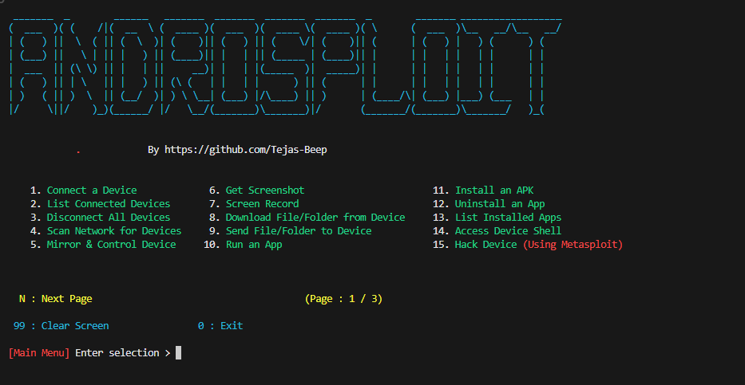
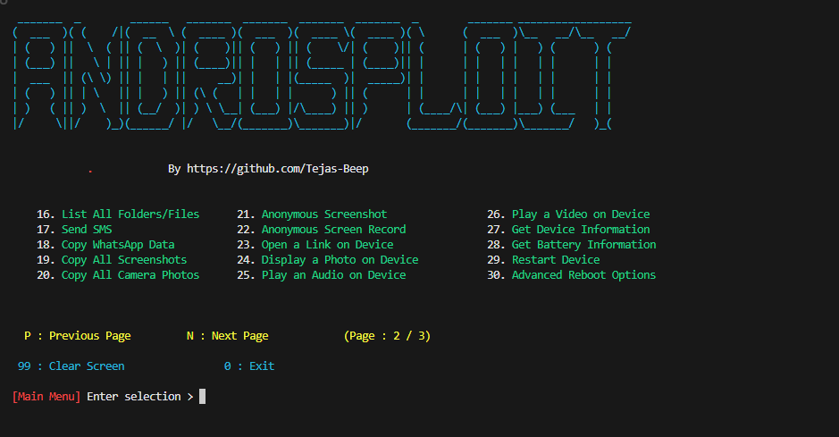
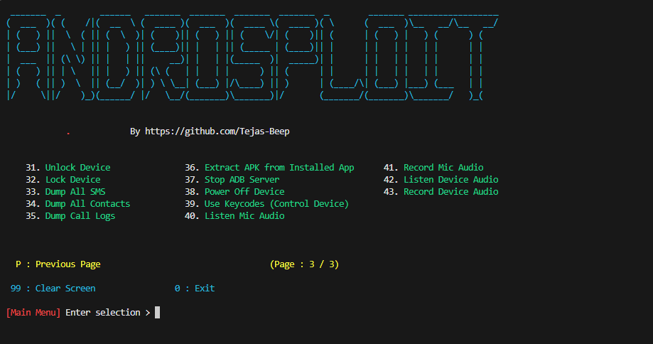

<div align="center">
  
# 🤖 AndroSploit
  
### 🤖 Android Exploitation Toolkit with Metasploit Integration.

An all-in-one hacking tool written in `Python` to remotely exploit Android devices using `ADB` (Android Debug Bridge) and `Metasploit-Framework`.


</div>

#### Complete Automation to get a Meterpreter session in One Click

This tool can automatically __Create__, __Install__, and __Run__ payloads on target devices using __Metasploit-Framework__ and __ADB__ to gain control over Android devices with an open ADB port `TCP 5555`.

The goal of this project is to simplify penetration testing and vulnerability assessment on Android devices. Now you don't have to learn complex commands—AndroSploit automates the process for you.

> [!TIP]
> __AndroSploit__ can also function as a complete ADB Toolkit, allowing various operations on Android devices over Wi-Fi as well as USB. 

# 📷 Screenshots





# ✨ Features

* Connect devices using ADB remotely.
* List connected devices.
* Disconnect all devices.
* Access connected device shell.
* Stop ADB Server.
* Take screenshots and automatically pull them to the computer.
* Screen record target device and retrieve the video.
* Transfer files and folders between computer and target device.
* Install and uninstall APK files.
* Run applications remotely.
* List all installed apps.
* Restart/Reboot the target device into various modes (`System`, `Recovery`, `Bootloader`, `Fastboot`).
* __Exploit Device Completely__:
  - Automatically fetch `LHOST`.
  - Create, install, and execute payloads using `msfvenom`.
  - Launch and set up __Metasploit-Framework__ for a `meterpreter` session.
  - Gain full control over the device through Metasploit.
* List and manage files/folders on the target device.
* Copy WhatsApp data, screenshots, and camera photos to the computer.
* Take anonymous screenshots and recordings (auto-delete from target device).
* Open links, display images, and play media remotely.
* Retrieve device and battery information.
* Use keycodes to control the device remotely.
* Send and dump SMS messages.
* Unlock and lock the device remotely.
* Extract APKs from installed apps.
* Mirror and control the target device.
* Power off the target device.
* Scan the local network for connected devices.
* Record and stream audio from the microphone and device.

# 📋 Requirements  
* [`python3`](https://www.python.org/) : Python 3.10 or newer
* [`pip`](https://pip.pypa.io/en/stable/installation/) : Python package manager
* [`adb`](https://developer.android.com/studio/command-line/adb) : Android Debug Bridge
* [`metasploit-framework`](https://www.metasploit.com/) : Metasploit-Framework
* [`scrcpy`](https://github.com/Genymobile/scrcpy) : Scrcpy
* [`nmap`](https://nmap.org/) : Nmap

# 👨🏻‍💻 Run AndroSploit

__AndroSploit__ runs directly using `python3`.

> [!IMPORTANT]
> Ensure you have Python __3.10 or higher__ before running the program.

#### On Linux / macOS :
```
git clone https://github.com/Tejas-beep/AndroSploit.git
```
```
cd AndroSploit/
```
```
pip install -r requirements.txt
```
```
python3 androsploit.py
```
#### On Windows :
```
git clone https://github.com/Tejas-beep/AndroSploit.git
```
```
cd AndroSploit/
```
```
pip install -r requirements.txt
```
```
python androsploit.py
```

# 💡 Tutorial


## Setting up Android Phone for the first time

* __Enabling the Developer Options__

1. Open `Settings`.
2. Go to `About Phone`.
3. Find `Build Number`.
4. Tap on `Build Number` 7 times.
5. Enter your pattern, PIN or password to enable the `Developer options` menu.
6. The `Developer options` menu will now appear in your Settings menu.

* __Enabling USB Debugging__

1. Open `Settings`.
2. Go to `System` > `Developer options`.
3. Scroll down and Enable `USB debugging`.

* __Connecting with Computer__

1. Connect your Android device and `adb` host computer to a common Wi-Fi network.
2. Connect the device to the host computer with a USB cable.
3. Open a terminal in the computer and enter the following command :
```
adb devices
```
4. A pop-up will appear in the Android phone when you connect your phone to a new PC for the first time : `Allow USB debugging?`.
5. Click on `Always allow from this computer` check-box and then click `Allow`.
6. Then in the terminal enter the following command :
```
adb tcpip 5555
```
7. Now you can connect the Android Phone with the computer over Wi-Fi using `adb`.
8. Disconnect the USB cable.
9. Go to `Settings` >  `About Phone` > `Status` > `IP address` and note the phone's `IP Address`.
10. Run __AndroSploit__ and select `Connect a device` and enter the target's `IP Address` to connect over Wi-Fi.


# This tool is tested on

-  ✅ Ubuntu
-  ✅ Linux Mint
-  ✅ Kali Linux
-  ✅ Fedora
-  ✅ Arch Linux
-  ✅ Parrot Security OS
-  ✅ Windows 11
-  ✅ Termux (Android)

> [!NOTE]
> All the new features are primarily tested on **Linux**, thus **Linux** is recommended for running AndroSploit.
Some features might not work properly on Windows.
    

# ⚠️ Disclaimer

* This project is for educational purposes only.
* The developer is not responsible for any misuse or damage caused by this project.
* Please use this tool ethically and responsibly on devices you own.
* The end-user is responsible for obeying all local, state, and international laws.

# 🛠️ Developer

**Tejas Mahajan** - [@TejasMahajan](https://github.com/Tejas-beep)

# ❤️ Support Me
If you like my work, consider supporting me via:

<a href="https://paypal.me/Tejasmahajan18" target="_blank"> <kbd> </a>
